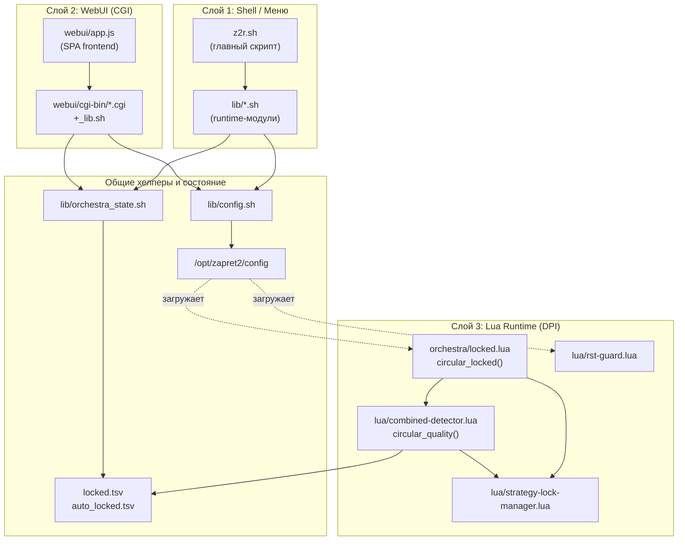
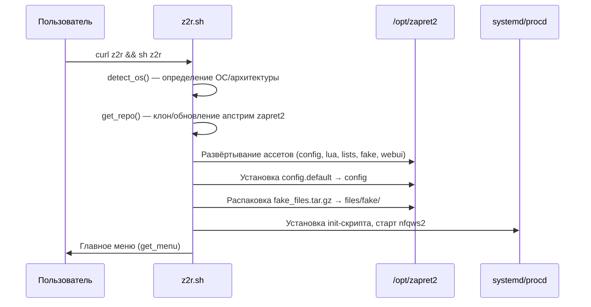
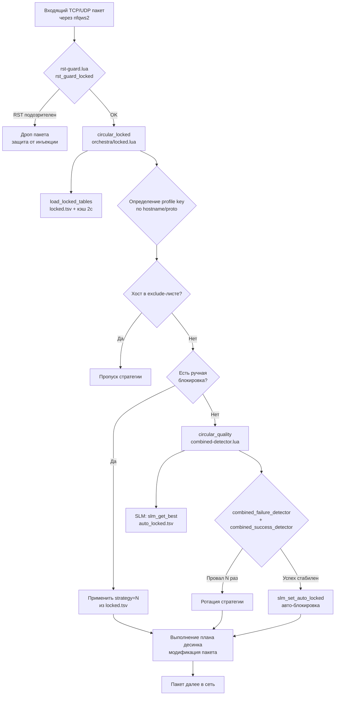
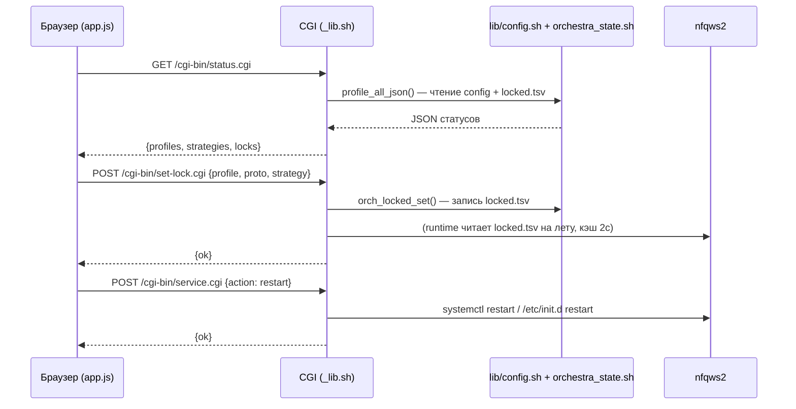
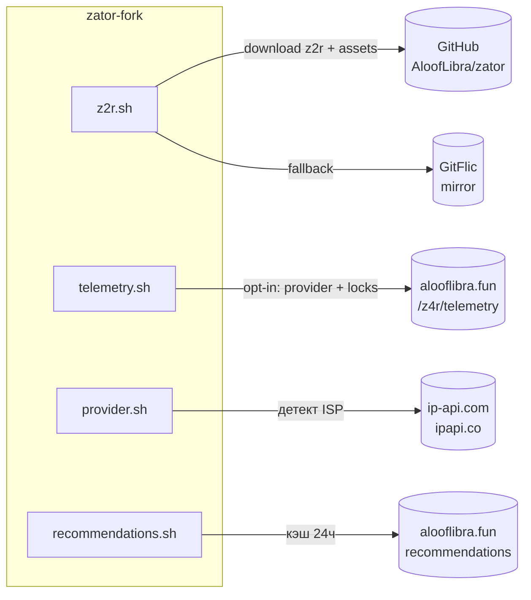
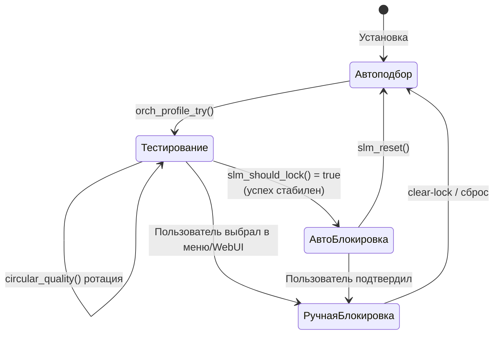
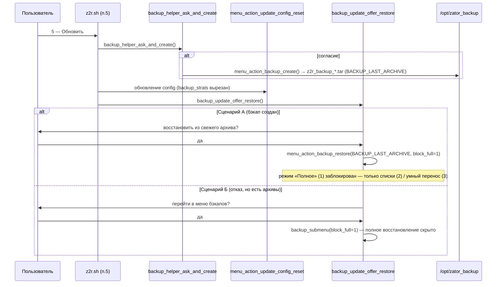

# Архитектура проекта zator-fork

> Документ предназначен для AI-агентов: позволяет за 10 минут войти в контекст
> проекта без перечитывания всего кода. Содержит конкретные факты, таблицы и
> диаграммы Mermaid. Дополняет [`PROJECT_NAVIGATION.md`](../PROJECT_NAVIGATION.md)
> (карта файлов) и [`AGENTS.md`](../AGENTS.md) (правила редактирования).

---

## 1. High-Level Overview

### 1.1 Какую задачу решает проект

`zator-fork` — это форк **zapret4rocket (z4r)**, оболочка-установщик и менеджер
вокруг апстрим-инструмента **zapret2** (автор bol-van). Цель — обход блокировок
ТСПУ/DPI со стороны РКН (Роскомнадзор) для YouTube, Discord, Google Video и
прочих ресурсов на территории РФ.

Проект автоматизирует полный жизненный цикл:

1. **Установка** апстрим `zapret2` + развёртывание собственных ассетов (конфиг,
   списки, fake-пейлоады, Lua-модули, WebUI).
2. **Адаптация** под провайдера/локацию (авто-детект ISP, рекомендации стратегий).
3. **Управление** стратегиями обхода (интерактивный подбор + блокировка рабочей).
4. **Мониторинг** через локальный WebUI (статус, проверки, управление сервисом).

### 1.2 Целевые платформы

| Платформа | Семейство | Особенности |
|-----------|-----------|-------------|
| VPS | Ubuntu / Debian | Основная цель, systemd, полный набор функций |
| OpenWRT / ImmortalWRT | OpenWRT | procd, uhttpd, ограниченные ресурсы |
| Keenetic (Entware) | Entware | opkg, init.d, детект WAN-интерфейса |
| MerlinWRT | Asuswrt-Merlin | amng, jffs, перезапуск WAN |
| x-wrt / kwrt / istoreos | OpenWRT-derivatives | совместимы с OpenWRT-веткой |

### 1.3 Технологический стек и обоснование

| Слой | Технология | Почему именно она |
|------|-----------|-------------------|
| Оркестрация / CLI | **Bash** | Доступен на всех целевых платформах (включая BusyBox); апстрим zapret2 написан на Bash; нулевые внешние зависимости |
| Runtime DPI-логика | **Lua** | `nfqws2` (ядро zapret2) поддерживает `--lua-init`/`--lua-desync` для встраивания скриптов в обработку пакетов; лёгкий, быстрый, низкое потребление RAM на роутерах |
| WebUI backend | **Shell CGI** | uhttpd/busybox httpd уже есть на OpenWRT/Entware; не требует Python/Node; работает на устройствах с 32–128 MB RAM |
| WebUI frontend | **Vanilla JS** | Один файл [`webui/app.js`](../webui/app.js), без сборки, без фреймворков; мгновенная загрузка на слабых CPU |
| Парсинг конфига | **awk / sed / grep** | Стандартные POSIX-утилиты; предсказуемое поведение на BusyBox |
| Fake-пейлоады | **Бинарные файлы** (`fake/*.bin`) | Готовые TLS ClientHello / QUIC / WireGuard / SYN пакеты для подмены |

> **Ключевой принцип стека:** ноль обязательных внешних зависимостей сверх того,
> что уже есть в прошивке роутера или базовой ОС. Это критично для embedded-целей.

---

## 2. Архитектура и структура проекта

### 2.1 Трёхслойная архитектура

Проект построен на **трёх взаимодействующих слоях**, которые разделяют
ответственность, но разделяют общие хелперы и файлы состояния:



| Слой | Ответственность | Технология |
|------|----------------|------------|
| **Shell / Меню** | Установка, развёртывание ассетов, редактирование конфига, старт/стоп сервисов, запись ручных блокировок стратегий | Bash |
| **WebUI** | Чтение статуса, перезапуск сервисов, проверки, запись блокировок — через те же shell-хелперы | Shell CGI + JS |
| **Lua Runtime** | Применение автоматических и ручных блокировок стратегий в реальном времени при обработке пакетов | Lua (внутри nfqws2) |

> **Важное следствие:** многие изменения, выглядящие как «только конфиг», также
> затрагивают shell-меню. Многие изменения, выглядящие как «только shell»,
> ограничены Lua-нумерацией профилей и семантикой `strategy=N`.

### 2.2 Дерево каталогов (исходный репозиторий)

```
zator-fork/
├── z2r.sh                      # Главный скрипт: install/update/menu/lifecycle
├── config.default              # Статический шаблон конфига (контракт; НЕ редактируется в runtime)
├── AGENTS.md                   # Правила редактирования (обязательно к прочтению)
├── PROJECT_NAVIGATION.md       # Карта файлов для агентов
├── README.md                   # Пользовательская документация + changelog
├── recommendations.txt         # База рекомендаций по провайдерам
├── fake_files.tar.gz           # Архив fake-пейлоадов (деплой z2r.sh)
│
├── lib/                        # Runtime shell-модули (источник)
│   ├── config.sh               #   Чтение/правка /opt/zapret2/config
│   ├── orchestra_state.sh      #   Чтение/запись locked.tsv, проверка nfqws2
│   ├── strategies.sh           #   Статус стратегий, подбор, блокировки
│   ├── actions.sh              #   Сброс/бэкап, тумблеры, blob, порты
│   ├── submenus.sh             #   Подменю (стратегии/домены/порты/...)
│   ├── ui.sh                   #   Хелперы терминального UI
│   ├── netcheck.sh             #   Проверки связности, CDN, YT-кластер
│   ├── provider.sh             #   Детект ISP/локации, кэш, override
│   ├── recommendations.sh      #   База подсказок по провайдеру
│   ├── telemetry.sh            #   Опциональная телеметрия
│   └── premium.sh              #   Easter-egg меню (шутка)
│
├── lua/                        # Lua-модули runtime (источник)
│   ├── strategy-lock-manager.lua   #   Единый источник блокировок/нормализации
│   ├── combined-detector.lua       #   Детекторы успеха/провала, circular_quality()
│   ├── domain-grouping.lua         #   Группировка родственных доменов
│   ├── silent-drop-detector.lua    #   Детектор тихих дропов
│   └── rst-guard.lua               #   Защита от инъекции RST
│
├── orchestra/
│   └── locked.lua              # Адаптер блокировок: circular_locked()
│
├── extra_strats/               # Слоты стратегий + спецсписки
│   ├── TCP/{YT,GV,RKN}/        #   Стратегии TCP (нумерованные .txt)
│   └── UDP/YT/                 #   Стратегии UDP
│
├── fake/                       # Бинарные fake-пейлоады
│   ├── tls_clienthello_*.bin   #   TLS ClientHello варианты
│   ├── quic_*.bin              #   QUIC Initial пакеты
│   ├── wg_initial_fake_*.bin   #   WireGuard handshake
│   ├── discord_udp_*.bin       #   Discord UDP
│   └── syn_packet.bin          #   SYN для TCP
│
├── lists/                      # Хостлисты и ipset'ы
│   ├── russia-youtube.txt      #   YT-домены
│   ├── russia-discord.txt      #   Discord-домены
│   ├── cloudflare-ipset*.txt   #   Cloudflare IP
│   └── ...
│
├── webui/                      # Локальный WebUI (порт 17682)
│   ├── index.html              #   Точка входа
│   ├── app.js                  #   SPA (vanilla JS)
│   ├── styles.css              #   Стили + темы
│   ├── run-webui.sh            #   Детект/старт/стоп HTTP-сервера
│   └── cgi-bin/
│       ├── _lib.sh             #     Общий CGI: парсинг, JSON, api_*
│       ├── status.cgi          #     GET статус
│       ├── set-lock.cgi        #     POST блокировка стратегии
│       ├── clear-lock.cgi      #     POST снятие блокировки
│       ├── service.cgi         #     POST старт/стоп/рестарт
│       └── check.cgi           #     GET проверки
│
├── blockcheck2.d/z4r/          # Профиль тестов для blockcheck2
│   ├── 10-list.sh              #   Определения check_list/pktws_check_*
│   ├── list_https_tls12.txt    #   Список HTTPS (TLS 1.2)
│   └── list_https_tls13.txt    #   Список HTTPS (TLS 1.3)
│
├── Entware/                    # Патчи Keenetic/Entware
│   ├── 000-zapret2.sh          #   netfilter.d-хук (своё имя, не конфликтует со старым zapret)
│   ├── S00fix                  #   фикс
│   └── zapret                  #   интеграция
│
├── z4r_test.sh                 # Вспомогательный скрипт тестов
├── user_test2.sh               # Пользовательский тест
├── merlin_wan_restart_zapret.sh # Перезапуск WAN на Merlin
│
├── tests/                      # Smoke-тесты (bash, изоляция в /tmp, без разворота роутера)
│   ├── profile_lock_smoke.sh   #   Блокировки профилей, locked.tsv, идемпотентность profile_apply_all
│   ├── backup_smart_smoke.sh   #   Бэкап/умный перенос: tar-целостность, порты, blob'ы, флаги, сеттеры
│   └── ui_validation_smoke.sh  #   Валидаторы ввода: ui_is_number_in_range, ports_validate
│
├── docs/                       # Документация и регламенты
│   ├── architecture.md         #   Архитектура проекта (этот файл)
│   ├── development_guidelines.md #  Гайдлайны разработки
│   ├── SYNC_PROTOCOL.md        #   Регламент актуализации документации
│   └── refactoring_audit.md    #   Аудит дублирования кода (DUP_01–DUP_18)
```

### 2.3 Целевая структура развёртывания (`/opt/zapret2`)

После установки `z2r.sh` разворачивает ассеты в `/opt/zapret2`:

```
/opt/zapret2/
├── config                      # АКТИВНЫЙ runtime-конфиг (читают/правят все слои)
├── config.default              # Статический шаблон (источник для config)
├── nfqws2 / tpws / ...         # Бинари апстрим zapret2
├── lua/
│   ├── locked.lua              # Из orchestra/locked.lua
│   ├── rst-guard.lua           # Из lua/rst-guard.lua
│   ├── strategy-lock-manager.lua
│   ├── combined-detector.lua
│   ├── domain-grouping.lua
│   ├── silent-drop-detector.lua
│   └── dns-clone.lua
├── extra_strats/
│   ├── TCP/{YT,GV,RKN}/
│   ├── UDP/YT/
│   └── cache/orchestra/
│       ├── locked.tsv          # Ручные блокировки (TSV: profile\tproto\tstrategy)
│       ├── locked.manual.tsv   # Резервный файл ручных блокировок
│       └── auto_locked.tsv     # Авто-блокировки SLM
├── lists/                      # Хостлисты
├── files/fake/                 # Fake-пейлоады (из fake_files.tar.gz)
├── init.d/                     # init-скрипты
├── webui/                      # WebUI
└── z2r_lib/                    # Копия lib/*.sh (sourced z2r.sh)
```

> **Внимание:** большинство runtime-путей захардкожены как абсолютные
> (`/opt/zapret2/...`). Перемещение файлов ломает shell, конфиг и Lua.

### 2.4 Ключевые архитектурные паттерны

> **⚠️ Два файла конфигурации — не путать:**
> - **[`config.default`](../config.default)** (корень репозитория) — **статический
>   шаблон и контракт исходного кода**. Хранится в Git, разворачивается при установке.
>   В runtime сам по себе НЕ читается и НЕ редактируется.
> - **`/opt/zapret2/config`** (целевое устройство) — **активный рабочий конфиг**.
>   Именно его в runtime читают/парсят bash-скрипты (`sed`/`awk`), читает Lua
>   (номера профилей, `strategy=N`, `--lua-init`), изменяют меню и WebUI, и
>   загружает `nfqws2`. Все три слоя взаимодействуют через этот файл.
>
> При установке `z2r.sh` копирует `config.default` → `/opt/zapret2/config`.
> Дальше вся работа идёт с живым `/opt/zapret2/config`.

#### Паттерн 1: Структура конфига как API-поверхность

Структура `config.default` (и развёрнутого из него `/opt/zapret2/config`) — это
**контракт** между тремя слоями. Shell-код парсит `/opt/zapret2/config` через
`sed`/`awk` по маркерам; Lua читает номера профилей и `strategy=N`. Структурные
изменения в `config.default` каскадно ломают меню и runtime, потому что именно по
этой структуре работают все `sed`/`awk`-замены против `/opt/zapret2/config`.

**Маркеры блоков (НЕ переименовывать — есть и в шаблоне, и в runtime-конфиге):**

| Маркер | Назначение |
|--------|-----------|
| `#Z2R_TCP443_BEGIN` / `#Z2R_TCP443_END` | TCP 443 стратегии |
| `#Z2R_FALLBACK_BEGIN` / `#Z2R_FALLBACK_END` | Fallback TLS |
| `#Z2R_FALLBACK_HTTP_BEGIN` / `#Z2R_FALLBACK_HTTP_END` | Fallback HTTP |
| `#Z2R_DNS_BEGIN` / `#Z2R_DNS_END` | Антиспуф DNS (UDP:53) |
| `#Z2R_WG_BEGIN` / `#Z2R_WG_END` | WireGuard |
| `#Z2R_QUIC443_BEGIN` / `#Z2R_QUIC443_END` | QUIC 443 |

#### Паттерн 2: Профили стратегий (key=1..10 + WG + QUIC443)

Активный конфиг (`/opt/zapret2/config`, развёрнутый из `config.default`)
определяет профили через блоки `--new` с `--lua-desync=circular_locked:key=N`:

| key | Назначение | Прото | Шаблон/стратегии |
|-----|-----------|-------|------------------|
| 1 | YouTube TCP | TCP | `z2r_tcp_tls_common` (1–29) |
| 2 | googlevideo TCP 443 | TCP | GV-слоты |
| 3 | RKN (общие блокировки) | TCP | RKN-слоты |
| 4 | Discord TCP | TCP | RKN/Discord |
| 5 | YouTube UDP (QUIC) | UDP | QUIC-слоты |
| 6 | Voice UDP | UDP | STUN/голос |
| 7 | Games UDP | UDP | игровые |
| 8 | Fallback TLS | TCP | `#Z2R_FALLBACK` |
| 9 | Fallback HTTP | TCP | `#Z2R_FALLBACK_HTTP` |
| 10 | DNS антиспуф (UDP:53) | UDP | `#Z2R_DNS` |
| WG | WireGuard | UDP | `#Z2R_WG` |
| QUIC443 | QUIC на 443 | UDP | `#Z2R_QUIC443` |

#### Паттерн 3: Blob-система

Активный конфиг (`/opt/zapret2/config`) объявляет бинарные пейлоады через
`--blob=NAME:@/opt/zapret2/files/fake/FILE`. Имена blob'ов **захардкожены** в
shell и Lua — нельзя переименовывать:

| Blob-имя | Файл | Назначение |
|----------|------|-----------|
| `maxru` | tls_clienthello_max_ru.bin | Макс. RU TLS fake |
| `fakewgblob` | wg_initial_fake_*.bin | WireGuard fake |
| `quic_google` | quic_*.bin | QUIC для Google |
| `discord_fake` | discord_udp_*.bin | Discord UDP fake |
| `stun_fake` | (STUN) | STUN fake |
| `fake_default_tls` | tls_clienthello_*.bin | Дефолтный TLS |

#### Паттерн 4: Разделение ручных и авто-блокировок

| Файл | Кто пишет | Кто читает |
|------|----------|-----------|
| `locked.tsv` | Меню / WebUI (ручные) | `orchestra/locked.lua` (runtime) |
| `locked.manual.tsv` | `z2r.sh` (временный переключатель) | runtime |
| `auto_locked.tsv` | `lua/strategy-lock-manager.lua` (авто-обучение) | SLM + runtime |

---

## 3. Data Flow & Communication

### 3.1 Поток установки и развёртывания



### 3.2 Поток обработки пакета в runtime (Lua)

Это сердце системы — как DPI-логика применяется к каждому пакету:



**Ключевые функции runtime:**

| Функция | Файл | Роль |
|---------|------|------|
| `circular_locked(ctx, desync)` | [`orchestra/locked.lua`](../orchestra/locked.lua) | Главная точка входа: оркестрация, выбор стратегии, выполнение плана |
| `circular_quality(ctx, desync)` | [`lua/combined-detector.lua`](../lua/combined-detector.lua) | Качественная ротация с авто-блокировкой |
| `rst_guard_locked(ctx, desync)` | [`lua/rst-guard.lua`](../lua/rst-guard.lua) | Комбинация: guard + circular_locked |
| `combined_failure_detector()` | [`lua/combined-detector.lua`](../lua/combined-detector.lua) | Детект: stall, RST, TLS alert, HTTP status, DPI stub, block page |
| `combined_success_detector()` | [`lua/combined-detector.lua`](../lua/combined-detector.lua) | Детект успеха по протоколу |
| `slm_*` | [`lua/strategy-lock-manager.lua`](../lua/strategy-lock-manager.lua) | Единый менеджер блокировок/нормализации |

### 3.3 Поток взаимодействия с WebUI



> **Важно:** WebUI и меню **разделяют** [`lib/config.sh`](../lib/config.sh) и
> [`lib/orchestra_state.sh`](../lib/orchestra_state.sh). Изменения в этих хелперах
> влияют на обе поверхности. CGI-слой [`webui/cgi-bin/_lib.sh`](../webui/cgi-bin/_lib.sh)
> переиспользует runtime-либы через `find_runtime_libs()`.

#### 3.3.1 Fallback (безразборный режим) в WebUI

Fallback (безразборный режим) позволяет обходить блокировки для **всех доменов**,
а не только из RKN-списков. Это полезно, когда нужно применить стратегии ко всему
трафику, а не только к заблокированным ресурсам.

**Профили fallback:**

| Профиль | Назначение | Маркеры блоков в config |
|---------|-----------|-------------------------|
| 8 | Fallback TLS | `#Z2R_FALLBACK_BEGIN` / `#Z2R_FALLBACK_END` |
| 9 | Fallback HTTP | `#Z2R_FALLBACK_HTTP_BEGIN` / `#Z2R_FALLBACK_HTTP_END` |

**Механизм работы:**

- **Включение/выключение:** управление через `--skip` префикс перед `--filter-tcp=`
  в fallback-блоках. Если все строки начинаются с `--skip`, режим выключен.
- **Выбор стратегии:** активная стратегия определяется по наличию
  `--hostlist-domains= --` (активна) vs `--hostlist-domains=none.dom --` (неактивна).
  Стратегия `0` означает, что все строки помечены `--skip` (режим выключен).

**Архитектура реализации в WebUI:**

WebUI использует **локальные копии** функций fallback-логики, чтобы не зависеть
от файлов вне директории `webui/`. Это важно для изоляции и переносимости.

| Компонент | Файл | Роль |
|-----------|------|------|
| Локальные функции | [`webui/cgi-bin/_lib.sh`](../webui/cgi-bin/_lib.sh) | `_fallback_state()`, `_fallback_set_state()` — копии CLI-логики из `lib/actions.sh` |
| API endpoints | [`webui/cgi-bin/settings.cgi`](../webui/cgi-bin/settings.cgi) | Обработка запросов `fallback`, `fallback_state` |
| Frontend функции | [`webui/app.js`](../webui/app.js) | `renderFallbackSettings()`, `refreshFallbackSettings()`, `applyFallbackState()` |
| UI панель | [`webui/index.html`](../webui/index.html) | Чекбокс вкл/выкл безразборного режима |
| Тестовый сервер | [`webui/dev/fake_router_server.py`](../webui/dev/fake_router_server.py) | Python-реализация `_fallback_*` функций для dev-окружения |

> **Примечание:** выбор стратегий для fallback-профилей 8/9 выполняется через
> общий механизм карточек профилей (`set-lock.cgi` → `api_set_lock()` →
> `profile_state_set_and_apply()`), который пишет в `locked.manual.tsv`.
> Отдельный API `fallback_strategy` и хелперы `_fallback_current_strategy()` /
> `_fallback_set_strategy()` удалены как неиспользуемые.

**API контракты:**

```
GET /cgi-bin/settings.cgi?setting=fallback
→ {"state": "включен" | "выключен"}

POST /cgi-bin/settings.cgi
  Content-Type: application/x-www-form-urlencoded
  Body: setting=fallback_state&value=0|1
→ {"ok": true, "reboot_required": true}
```

> **Важно:** Функции `_fallback_*` в `webui/cgi-bin/_lib.sh` являются **локальными
> копиями** CLI-логики из `lib/actions.sh` (`backup_smart_set_fallback`,
> `toggle_fallback_mode`). Изменения в CLI-версии требуют синхронизации с WebUI-копиями.
> См. также [`AGENTS.md`](../AGENTS.md) раздел "High-Risk Areas" и
> "What To Check First For Typical Tasks" → "For fallback (безразборный режим) issues".

### 3.4 «Схема данных» (файлы состояния)

Проект не использует БД. Состояние хранится в текстовых файлах:

| Файл | Формат | Содержимое | Писатель | Читатель |
|------|--------|-----------|----------|----------|
| `/opt/zapret2/config` | shell-переменные + блоки | Весь конфиг zapret2 | меню, WebUI, `z2r.sh` | nfqws2, все слои |
| `extra_strats/cache/orchestra/locked.tsv` | TSV `profile\tproto\tstrategy` | Ручные блокировки | меню, WebUI | `locked.lua` |
| `locked.manual.tsv` | TSV | Резерв ручных блокировок | `z2r.sh` | `locked.lua` |
| `auto_locked.tsv` | TSV | Авто-обученные блокировки SLM | `strategy-lock-manager.lua` | SLM, runtime |
| `provider.txt` | текст | Детект провайдера/локации | `provider.sh` | рекомендации, телеметрия |
| `recommendations.txt` | текст | Кэш подсказок (24ч) | `recommendations.sh` | меню |
| `/opt/zator_backup/z2r_backup_*.tar` | tar-архив (BusyBox) | Снимок config + списков/состояний/блокировок | `lib/actions.sh` (п.21) | `lib/actions.sh` (п.21) |

**Формат `locked.tsv`** (пример):
```
1	tls	5
2	tls	3
5	udp	2
```
Где колонки: `profile_key`, `proto` (tls/http/udp), `strategy` (номер).

### 3.5 Внешние интеграции



| Интеграция | Назначение | Опциональность |
|-----------|-----------|----------------|
| GitHub (`raw.githubusercontent.com`) | Скачивание `z2r.sh` и ассетов | Основной источник |
| GitFlic (зеркало) | Fallback при блокировке GitHub | Авто-fallback |
| ip-api.com / ipapi.co | Детект провайдера и локации | Авто, с fallback |
| alooflibra.fun `/z4r/telemetry` | Анонимная телеметрия (провайдер + 4 блокировки) | **Opt-in** (один раз) |
| alooflibra.fun (recommendations) | База рекомендаций стратегий | Кэш 24ч |

### 3.6 Жизненный цикл блокировки стратегии



- **Автоподбор** — `circular_quality()` перебирает стратегии, `combined_failure_detector`/`combined_success_detector` оценивают результат.
- **АвтоБлокировка** — `slm_record_result()` копит статистику, `slm_should_lock()` решает зафиксировать лучшую стратегию в `auto_locked.tsv`.
- **РучнаяБлокировка** — меню/WebUI пишет в `locked.tsv` через `orch_locked_set()`; `circular_locked()` приоритетно применяет ручные блокировки над авто.

### 3.7 Поток бэкапа/восстановления (пункт 21)

Ротационный бэкап-менеджер — отдельный поток в shell-слое, не затрагивающий
Lua-runtime напрямую. Вся логика инлайн в [`lib/actions.sh`](../lib/actions.sh)
(`menu_action_backup_*`) и [`lib/submenus.sh`](../lib/submenus.sh)
(`backup_submenu`). Новых файлов не создаётся.

> **Сигнатуры (актуализировано):**
> `menu_action_backup_restore([preset_archive], [block_full])` — необязательный
> `preset_archive` пропускает выбор архива (восстановление из только что
> созданного бэкапа после обновления); `block_full=1` **скрывает режим 1
> «Полное»** (защита обновлённого config от перезаписи старым файлом из архива).
> `backup_submenu([block_full])` пробрасывает флаг в восстановление. Менеджер
> интегрирован в обновление (п.5) и удаление (п.4) через унифицированные хелперы
> `backup_helper_ask_and_create()` / `backup_update_offer_restore()` — см. §3.8.

```mermaid
sequenceDiagram
    participant U as Пользователь
    participant M as backup_submenu (п.21)
    participant A as lib/actions.sh
    participant FS as /opt/zapret2
    participant BKP as /opt/zator_backup

    Note over U,BKP: Создание
    U->>M: 1 — Создать бэкап
    M->>A: menu_action_backup_create()
    A->>FS: Сбор config + списки/состояния/блокировки
    A->>A: Упаковка во временный /tmp/stage_$$ → .tar (BusyBox)
    A->>BKP: Перемещение z2r_backup_YYYYMMDD_HHMMSS.tar

    Note over U,BKP: Восстановление
    U->>M: 2 — Восстановить
    M->>A: backup_pick_archive() → нумерованный список .tar
    U->>A: выбор архива + режим (1=полное / 2=только списки / 3=умный перенос)
    Note over A: режим 1: backup_check_blobs() → stop → config + списки доменов + стратегии
    Note over A: режим 2: stop → списки доменов + стратегии (config не затронут)
    Note over A: режим 3: stop → menu_action_backup_restore_smart()
    Note over A: режим 3: config НЕ заменяется; из бэкапа точечно переносятся
    Note over A: порты NFQWS2_PORTS_*, blob'ы (по совпадению имён), флаги п.13/18/19/20
    Note over A: blob отсутствует (режим 1) → импорт прерван, ничего не изменено
    A->>FS: start zapret2 (если был активен)

    Note over U,BKP: Удаление
    U->>M: 3 — Удалить
    M->>A: backup_pick_archive() → rm -f выбранного архива
```

**Состав архива** (пути относительно `/opt/zapret2`, источник истины —
`z2r_backup_state_files()` в [`lib/actions.sh`](../lib/actions.sh)):

| Файл | Режим 1 (полное) | Режим 2 (списки) | Режим 3 (умный перенос) |
|------|-----------|-----------|-----------|
| `config` (все переключения: fallback, RST, WireGuard, QUIC, порты, MODE_FILTER, FLOWOFFLOAD, FWTYPE, TLS blob, reasm-disable, voice) | ✅ «как в бэкапе» | ❌ не затрагивается | ⚠️ точечно: порты + blob'ы + флаги (см. ниже) |
| `lists/netrogat.txt`, `extra_strats/TCP_Custom.txt` | ✅ | ✅ | ✅ |
| `extra_strats/cache/orchestra/{locked,locked.manual,auto_locked}.tsv` | ✅ | ✅ | ✅ |

> `provider.txt` и `recommendations.txt` в архив **не** входят — это кэш
> авто-детекта провайдера/рекомендаций, не пользовательские настройки.

**Проверка перед восстановлением (только режим 1):**

| Сценарий | Реакция |
|----------|---------|
| `config` из архива ссылается на отсутствующий blob-файл | `backup_check_blobs()` прерывает импорт — ничего не изменяется на устройстве |

> Валидация номеров стратегий **не** производится: они уже прописаны в самом
> config. В режиме 1 проверяются только blob-файлы — без них nfqws2 не запустится.
> В режиме 2 config не затрагивается, поэтому проверка blob не требуется.
> В режиме 3 проверка blob не нужна: синхронизация идёт по совпадению имён и
> переносит только те файлы, которые физически существуют на устройстве.

#### Режим 3 — умный (неразрушающий) перенос настроек

В отличие от режима 1 (деструктивная замена всего `config`), режим `3` оставляет
**живой** `/opt/zapret2/config` на месте. Старый `config` из распакованного архива
становится **только источником данных для чтения**. Перенос выполняет
[`menu_action_backup_restore_smart()`](../lib/actions.sh) (`lib/actions.sh`),
вызывая три этапа:

| Этап | Функция | Что переносит | Механизм записи |
|------|---------|---------------|-----------------|
| Порты | `backup_smart_apply_ports()` | `NFQWS2_PORTS_TCP`, `NFQWS2_PORTS_UDP` целиком + `--filter-tcp` блока RKN | `config_set_var()` + `ports_set_rkn_filter()` (штатные) |
| Blob'ы | `backup_smart_apply_blobs()` | **Шаг 1:** `--blob=ИМЯ:@.../ФАЙЛ` — декларации для имён, есть в обоих конфигах; файл должен существовать. **Шаг 2:** режим maxru — `blob=fake_default_tls` ↔ `blob=maxru` в `--lua-desync=` (кроме `strategy=26`) | Шаг 1: `sed` по совпадению `ИМЯ`. Шаг 2: те же `sed` что `menu_action_set_tls_blob()`, определение режима через `config_tls_blob_mode_value()` |
| Флаги | `backup_smart_apply_flags()` | п.13 fallback, п.18 RST, п.19 reasm/voice/UDP-games/WG/QUIC443/FWTYPE/FLOWOFFLOAD/MODE_FILTER | `backup_smart_set_*()` — **единый источник sed-паттернов**; `toggle_*`/`menu_action_toggle_*` делегируют им (1=вкл/0=выкл). См. [`docs/refactoring_audit.md`](refactoring_audit.md) |

**Ключевые свойства режима 3:**

- **Неразрушающий:** структура/маркеры/новые блобы живого config сохраняются.
- **Сверка blob'ов по именам:** если в новом config появился блоб, которого не
  было в старом (например, добавлен `--blob=tls6:`), его дефолтное значение
  не трогается. Переносятся только совпадающие имена.
- **Синхронизация режима maxru:** blob прописывается в конфиге в двух местах —
  декларация (`--blob=maxru:@.../ФАЙЛ`) и ссылки в стратегиях (`blob=maxru` ↔
  `blob=fake_default_tls` в `--lua-desync=`). Переносятся оба. Режим `mixed`
  и `не определён` в старом конфиге не трогаются (неоднозначно).
- **Безопасность файлов:** blob переносится только если его файл физически есть
  в `/opt/zapret2/files/fake/` — иначе сохраняется дефолт нового config.
- **Порядок флагов:** RST-защита применяется раньше безразборного режима, т.к.
  меняет формат `--filter-tcp` в блоке fallback; fallback-сеттер умеет оба формата.
- **Идемпотентен:** повторный перенос того же бэкапа не ломает config.

> **Инвариант:** бэкап-менеджер использует только POSIX/BusyBox-совместимые
> конструкции (циклы `for`/`read`, временные файлы списков вместо bash-массивов),
> учитывает `set -e` и не вводит новых файлов в репозиторий.

**Тестовое покрытие** — [`tests/backup_smart_smoke.sh`](../tests/backup_smart_smoke.sh)
(29 проверок, изоляция в `/tmp`, возврат `0`/`1`):

| Группа | Что проверяется |
|--------|-----------------|
| tar-целостность | round-trip `tar -cf`/`tar -xf` + сверка sha256 config и вложенных файлов (механика `menu_action_backup_create`/`menu_action_backup_restore`) |
| `backup_smart_apply_ports` | перенос `NFQWS2_PORTS_TCP/UDP` + синхронизация `--filter-tcp` блока RKN |
| `backup_smart_apply_blobs` | совпадение имени → перенос; несовпадение имени → skip; отсутствие файла в `/opt/zapret2/files/fake/` → skip; синхронизация режима maxru (`strategy=26` защищена) |
| `backup_smart_apply_flags` | п.13/18/19/20 (Anti-RST, fallback, reasm, WG, QUIC443, игровой UDP, FWTYPE, FLOWOFFLOAD, MODE_FILTER) — сверка через `config_mode_text` |
| `backup_smart_set_*` | прямой round-trip вкл↔выкл каждого сеттера (единый источник sed-паттернов) |
| `backup_check_blobs` | режим1: все blob'ы есть → импорт разрешён (`rc=0`); отсутствующий → блокировка (`rc=1`) |
| идемпотентность | повторное применение не ломает маркеры `#Z2R_*` и баланс кавычек `NFQWS2_OPT` |

> **Изоляция:** конфиги создаются в `/tmp` и удаляются через `trap EXIT`; реальный
> `/opt/zapret2/config` не затрагивается. Единственная уступка хардкоду исходников
> (`backup_smart_apply_blobs`/`backup_check_blobs` проверяют файлы по абсолютному
> пути `/opt/zapret2/files/fake/`) — тест создаёт там несколько
> уникально-именованных blob-файлов (`z2r_smoke_*.bin`) и удаляет ровно их в `trap`.
> Валидаторы ввода покрыты отдельно в
> [`tests/ui_validation_smoke.sh`](../tests/ui_validation_smoke.sh) (34 проверки:
> `ui_is_number_in_range`, `ports_validate`, `ui_invalid_input`).

### 3.8 Интеграция бэкап-менеджера в обновление (п.5) и удаление (п.4)

Старый «одноразовый» механизм `backup_strats()` (копирование `extra_strats` →
`/opt/extra_strats` и `netrogat.txt` → `/opt/netrogat.txt`) **вырезан из пути
обновления** — из `menu_action_update_config_reset()` в
[`lib/actions.sh`](../lib/actions.sh). Сама функция `backup_strats()` сохранена
только для install-флоу ([`z2r.sh`](../z2r.sh), резерв стратегий/исключений при
чистой переустановке). Вместо неё обновление и удаление используют
**унифицированные хелперы** из [`lib/actions.sh`](../lib/actions.sh), которые
делегируют в ротационный менеджер (п.21) без дублирования кода:

| Хелпер | Роль |
|--------|------|
| `backup_helper_ask_and_create()` | Запрос Да/Нет перед операцией → при согласии `menu_action_backup_create()`. Результат в глобалях `BACKUP_HELPER_CONSENT` / `BACKUP_HELPER_CREATED` / `BACKUP_LAST_ARCHIVE`. Всегда `return 0` (безопасно для `set -e`) |
| `backup_update_offer_restore()` | После успешного обновления: Сценарий А (бэкап создан → предложить восстановить из свежего архива) или Сценарий Б (отказ → при наличии архивов предложить переход в подменю) |



**Удаление (п.4):** перед `remove_zapret()` в [`z2r.sh`](../z2r.sh) вызывается
`backup_helper_ask_and_create()`. Каталог `/opt/zator_backup` лежит **вне**
`/opt/zapret2`, поэтому `rm -rf /opt/zapret2` в `remove_zapret()` архивы **не
затрагивает** — они остаются доступны для восстановления после чистой
переустановки.

> **Инвариант (защита обновлённого config):** в контексте обновления
> (`block_full=1`) режим 1 «Полное» недоступен ни при прямом восстановлении
> (Сценарий А), ни в подменю бэкапов (Сценарий Б). Доступны только режим 2
> (списки доменов + стратегии) и режим 3 (умный перенос) — живой config не
> заменяется архивом целиком.

---

> **См. также:**
> - [`docs/development_guidelines.md`](development_guidelines.md) — Core Principles, AI Context Bootstrap
> - [`PROJECT_NAVIGATION.md`](../PROJECT_NAVIGATION.md) — детальная карта файлов и функций
> - [`AGENTS.md`](../AGENTS.md) — правила редактирования и зоны риска
